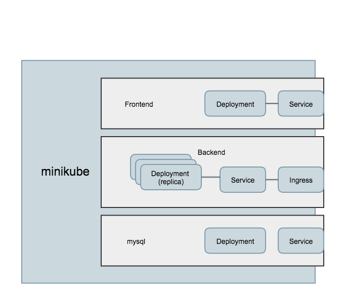
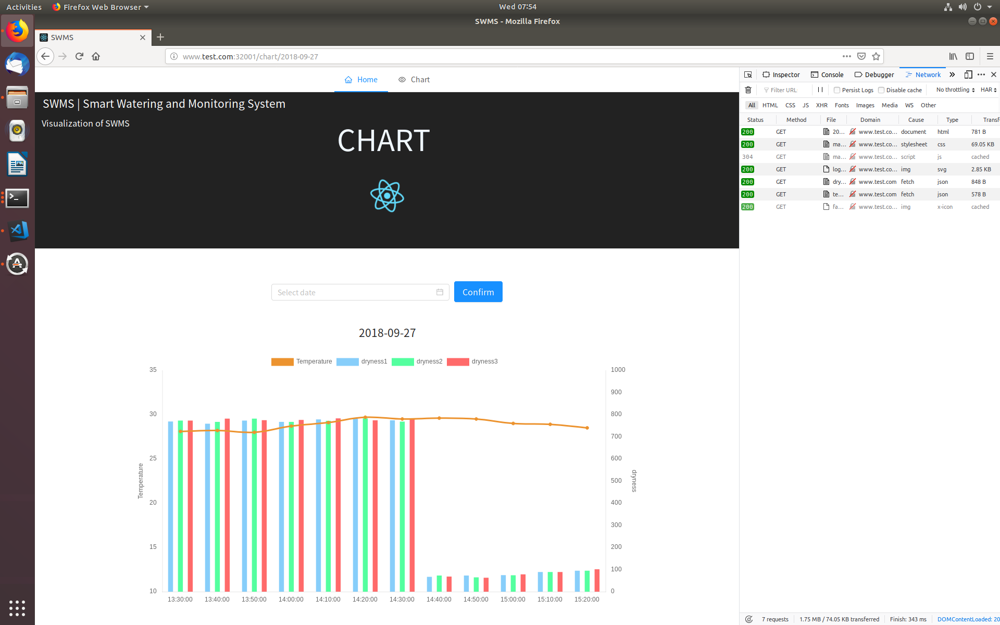

# Deploy your web application on Kubernetes

## Deployment Architecture


部署结构如图所示。所有配置文件在 `./k8s-deployment/yaml` 目录下。

为了便于调试，数据库与后端也暴露在 Kubernetes 外。

## Database Deployment

使用 Deployment 部署 MySQL 的 Pod，并使用 Service 对内暴露端口 3306 供后端访问。

在 minikube 内部，后端访问 `jdbc://mysql:3306` 连接数据库。`mysql` 字段由 Kubernetes 自己的 DNS 解析。(Service 名称叫做 mysql)

为了测试方便，使用 NodePort 对外暴露 32000 端口。

目前直接在 yaml 配置文件中修改环境变量改密码，其实可以使用 Secret 实现，保密更好。

## Frontend Deployment

同样使用 Deployment 部署前端的 Pod，并使用 Service 对外暴露 32001 端口供访问。

## Backend Deployment

同样使用 Deployment 部署后端的 Pod，并使用 Service 对内暴露 7070 端口，再使用 Ingress 对外暴露 80 端口，根据域名进行流量转发。

将 Ingress 配置为：只有当使用域名 www.test.com 访问后端时，才将流量转发给后端的 Service。（改hosts，让 www.test.com 指向 minikube ip）

当然也可以简单地仅仅使用 Service 对内/对外暴露端口供前端访问。

Part 4 负载均衡可以基于 Ingress，也可以简单地修改 Deployment 配置中的 replica 的值。

## Demo

### MySQL

可以通过 Kubernetes 的 32000 端口访问。
```sh
$ mysql -h192.168.99.100 -P32000 -uroot -p
Enter password: 

mysql> 
```

也可以另外启一个 mysql-client 的镜像，从 Kubernetes 内部访问 3306 端口，但是稍微麻烦了点。

### Backend

通过域名 www.test.com 可以正常访问后端
```sh
$ curl www.test.com/api/temperature?date=2018-09-27

[{"tid":45,"tdate":"2018-09-27","ttime":"13:30:00","temperature":28.1},{"tid":46,"tdate":"2018-09-27","ttime":"13:40:00","temperature":28.2},
...
{"tid":56,"tdate":"2018-09-27","ttime":"15:20:00","temperature":28.5}]
```

通过其他域名或直接通过 IP 无法正常访问后端
```sh
$ curl 192.168.99.100/api/temperature?date=2018-09-27
default backend - 404
```

### Frontend

访问 Kubernetes IP 的 32001 端口即可。



右侧 Network 一栏中可以看到，前端页面向 www.test.com 发送请求。