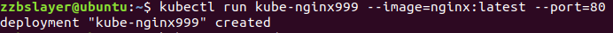
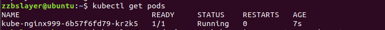
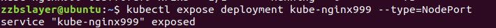
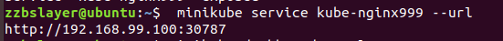
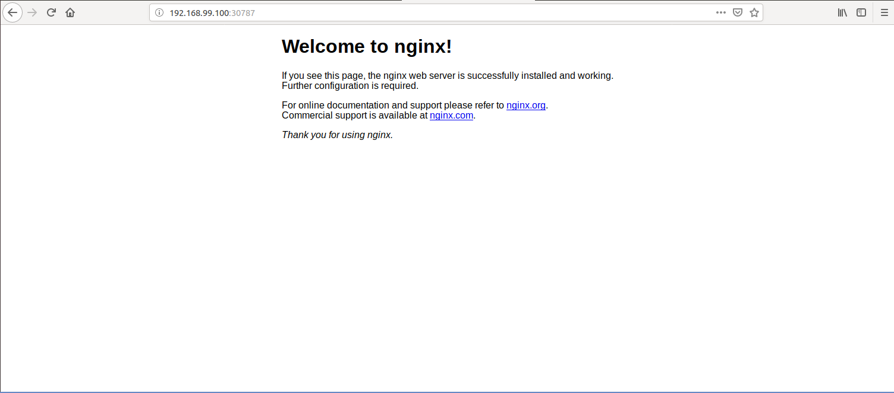
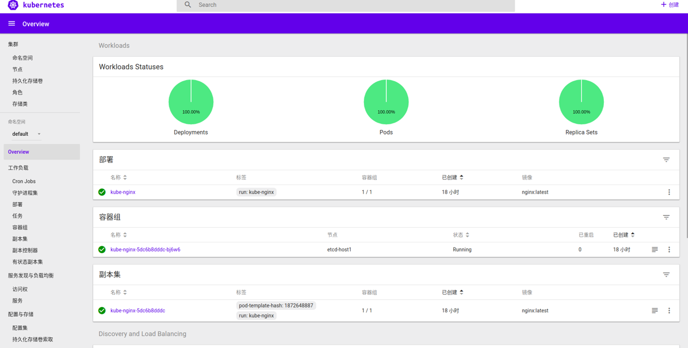
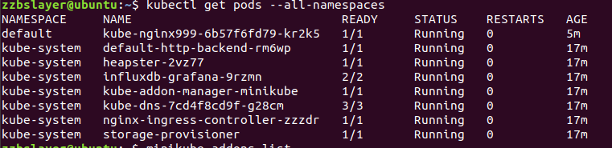
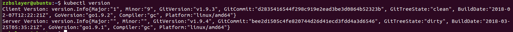

# kubectl-Minikube 

#### 搭建本地Minikube集群
Kubernetes是一个开源的，用于管理云平台中多个主机上的容器化的应用，Kubernetes的目标是让部署容器化的应用简单并且高效（powerful）,Kubernetes提供了应用部署，规划，更新，维护的一种机制。

Kubernetes一个核心的特点就是能够自主的管理容器来保证云平台中的容器按照用户的期望状态运行着（比如用户想让apache一直运行，用户不需要关心怎么去做，Kubernetes会自动去监控，然后去重启，新建，总之，让apache一直提供服务），管理员可以加载一个微型服务，让规划器来找到合适的位置，同时，Kubernetes也系统提升工具以及人性化方面，让用户能够方便的部署自己的应用（就像canary deployments）。

Kubernetes是为生产环境而设计的容器调度管理系统，对于负载均衡、服务发现、高可用、滚动升级、自动伸缩等容器云平台的功能要求有原生支持。


一个K8s集群是由分布式存储（etcd）、服务节点（Minion，etcd现在称为Node）和控制节点（Master）构成的。所有的集群状态都保存在etcd中，Master节点上则运行集群的管理控制模块。Node节点是真正运行应用容器的主机节点，在每个Minion节点上都会运行一个Kubelet代理，控制该节点上的容器、镜像和存储卷等。

Kubernetes中的主要概念：
1. Cluster : 集群是指由Kubernetes使用一系列的物理机、虚拟机和其他基础资源来运行你的应用程序。
2. Node : 一个node就是一个运行着Kubernetes的物理机或虚拟机，并且pod可以在其上面被调度.
3. Pod : 一个pod对应一个由相关容器和卷组成的容器组.
4. Label : 一个label是一个被附加到资源上的键/值对，譬如附加到一个Pod上，为它传递一个用户自定的并且可识别的属性.Label还可以被应用来组织和选择子网中的资源.
5. selector是一个通过匹配labels来定义资源之间关系得表达式，例如为一个负载均衡的service指定所目标Pod.
6. Replication Controller : replication controller 是为了保证一定数量被指定的Pod的复制品在任何时间都能正常工作.它不仅允许复制的系统易于扩展，还会处理当pod在机器在重启或发生故障的时候再次创建一个.
7. Service : 一个service定义了访问pod的方式，就像单个固定的IP地址和与其相对应的DNS名之间的关系。
8. Volume: 一个volume是一个目录，可能会被容器作为未见系统的一部分来访问。Kubernetes volume 构建在Docker Volumes之上,并且支持添加和配置volume目录或者其他存储设备.
9. Secret : Secret 存储了敏感数据，例如能允许容器接收请求的权限令牌。
10. Name : 用户为Kubernetes中资源定义的名字.
11. Namespace : Namespace 好比一个资源名字的前缀。它帮助不同的项目、团队或是客户可以共享cluster,例如防止相互独立的团队间出现命名冲突.
12. Annotation : 相对于label来说可以容纳更大的键值对，它对我们来说可能是不可读的数据，只是为了存储不可识别的辅助数据，尤其是一些被工具或系统扩展用来操作的数据.

#### 安装Docker 

docker之前已经安装过了这里就略去

#### 安装Kubectl

kubernetes通过kube-apiserver作为整个集群管理的入口。Apiserver是整个集群的主管理节点，用户通过Apiserver配置和组织集群，同时集群中各个节点同etcd存储的交互也是通过Apiserver进行交互。Apiserver实现了一套RESTfull的接口，用户可以直接使用API同Apiserver交互。但是官方提供了一个客户端kubectl随工具集打包，用于可直接通过kubectl以命令行的方式同集群交互。

因而kubectl是一个用于操作kubernetes集群的命令行接口,通过利用kubectl的各种命令可以实现各种功能,是在使用kubernetes中非常常用的工具。

##### 安装方式一：

直接将kubectl作为一个snap应用安装。

```
sudo snap install kubectl --classic   
kubectl version   # 验证安装是否成功
```

##### 安装方式二：

直接将kubectl作为一个snap应用安装。

```
curl -LO https://storage.googleapis.com/kubernetes-release/release/$(curl -s https://storage.googleapis.com/kubernetes-release/release/stable.txt)/bin/linux/amd64/kubectl  # 现在能翻墙的地方下载，在复制到指定服务器

chmod +x ./kubectl   # 赋二进制文件执行权限
sudo mv ./kubectl /usr/local/bin/kubectl  # 将二进制文件移到 PATH 中
kubectl version
```

#### 安装Minikube
MiniKube 是使用 Go 语言开发的，所以安装其实很方便，一是通过下载基于不同平台早已编译好的二级制文件安装，二是可以编译源文件安装。

安装Minikube的同时需要改变运行权限和移动位置

* Linux 安装
```bash
# 下载v0.24.1版本
> curl -Lo minikube https://storage.googleapis.com/minikube/releases/v0.24.1/minikube-linux-amd64 && chmod +x minikube && sudo mv minikube /usr/local/bin/

# 通过阿里云进行下载
curl -Lo minikube http://kubernetes.oss-cn-hangzhou.aliyuncs.com/minikube/releases/v0.28.0/minikube-linux-amd64 && chmod +x minikube && sudo mv minikube /usr/local/bin/
> minikube -h
```

#### 启动minikube

这里需要加入一个阿里云的镜像

```bash
>minikube start --registry-mirror=https://registry.docker-cn.com
```
首次启动会下载localkube，下载过程可能会失败，会有如下提示，

```bash
Starting local Kubernetes v1.8.0 cluster...
Starting VM...
Downloading Minikube ISO
 60.70 MB / 110.01 MB [====================>-----------------------]  46.21% 14s
E0106 14:06:03.884826   10434 start.go:150] Error starting host: Error attempting to cache minikube ISO from URL: Error downloading Minikube ISO: failed to download: failed to download to temp file: failed to copy contents: read tcp 10.0.2.15:47048->172.217.24.16:443: read: connection reset by peer.

================================================================================
An error has occurred. Would you like to opt in to sending anonymized crash
information to minikube to help prevent future errors?
To opt out of these messages, run the command:
    minikube config set WantReportErrorPrompt false
================================================================================
Please enter your response [Y/n]:
```
这个过程中如果下载成功，但是报了诸如VBoxManage not found这样的错误：

```bash
Starting local Kubernetes v1.8.0 cluster...
Starting VM...
Downloading Minikube ISO
 140.01 MB / 140.01 MB [============================================] 100.00% 0s
E0106 11:10:00.035369   10474 start.go:150] Error starting host: Error creating host: Error executing step: Running precreate checks.
: VBoxManage not found. Make sure VirtualBox is installed and VBoxManage is in the path.

 Retrying.
E0106 14:10:00.035780   10474 start.go:156] Error starting host:  Error creating host: Error executing step: Running precreate checks.
: VBoxManage not found. Make sure VirtualBox is installed and VBoxManage is in the path
================================================================================
An error has occurred. Would you like to opt in to sending anonymized crash
information to minikube to help prevent future errors?
To opt out of these messages, run the command:
    minikube config set WantReportErrorPrompt false
================================================================================
Please enter your response [Y/n]:
```
出了这样的问题的解决办法是安装 VirtualBox再重新启动

##### 安装virtualbox

```
sudo apt-get install virtualbox
```

##### 不设置虚拟机

minikube默认需要虚拟机来初始化kunernetes环境，但是使用Linux系统可以不需要的，可以在minikube start后追加–vm-driver=none参数来使用自己的环境。

```bash
> sudo minikube delete
> sudo minikube start --vm-driver=none
```
如果你安装了虚拟机，或者你在Linux下使用了minikube start --vm-driver=none，并且下载完毕，会有如下提示运行成功

```bash
Starting local Kubernetes v1.8.0 cluster...
Starting VM...
Getting VM IP address...
Moving files into cluster...
Downloading localkube binary
 148.25 MB / 148.25 MB [============================================] 100.00% 0s
 0 B / 65 B [----------------------------------------------------------]   0.00%
 65 B / 65 B [======================================================] 100.00% 0sSetting up certs...
Connecting to cluster...
Setting up kubeconfig...
Starting cluster components...
Kubectl is now configured to use the cluster.
===================
WARNING: IT IS RECOMMENDED NOT TO RUN THE NONE DRIVER ON PERSONAL WORKSTATIONS
    The 'none' driver will run an insecure kubernetes apiserver as root that may leave the host vulnerable to CSRF attacks

When using the none driver, the kubectl config and credentials generated will be root owned and will appear in the root home directory.
You will need to move the files to the appropriate location and then set the correct permissions.  An example of this is below:

    sudo mv /root/.kube $HOME/.kube # this will write over any previous configuration
    sudo chown -R $USER $HOME/.kube
    sudo chgrp -R $USER $HOME/.kube

    sudo mv /root/.minikube $HOME/.minikube # this will write over any previous configuration
    sudo chown -R $USER $HOME/.minikube
    sudo chgrp -R $USER $HOME/.minikube

This can also be done automatically by setting the env var CHANGE_MINIKUBE_NONE_USER=true
Loading cached images from config file.
```
#### 启动容器服务

```bash
# kube-nginx是要定义的容器名称 nginx:latest表明要用nginx镜像 --port=80表明容器对外暴露80端口
sudo kubectl run kube-nginx999 --image=nginx:latest --port=80 --image-pull-policy=IfNotPresent

deployment "kube-nginx999" created
```



#### 检查状态

```bash
> sudo kubectl get pods
```


#### 发布服务

```bash
sudo kubectl expose deployment kube-nginx999 --type=NodePort

> service "kube-nginx999" exposed
```



#### 服务地址

```bash
sudo minikube service kube-nginx999 --url
```


上面命令展示的地址即启动的nginx容器服务地址，访问 http://192.168.99.100:30787 即可出现nginx首页，服务成功启动！




#### 启动dashboard管理后台
dashboard是kubernetes提供的容器服务管理后台，可视化界面，用来进行机器负载，集群管理，镜像扩容，配置数据等相关操作

启动dashboard
```bash
# 打印出管理后台地址
> minikube dashboard --url

> minikube dashboard
```


#### 通过kubectl进行控制查看

**查看所有的节点**

```
kubectl get pods --all-namespaces
```



**查看client和server的version**

```
kubectl version
```



**查看所有的cs的状态**

```
kubectl get cs
```

